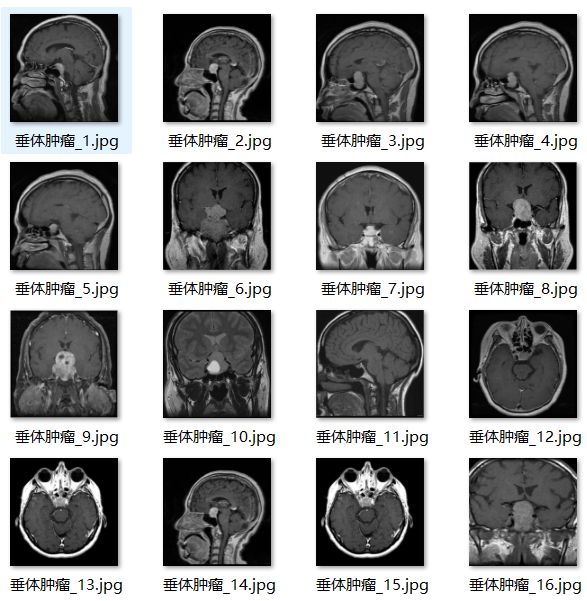
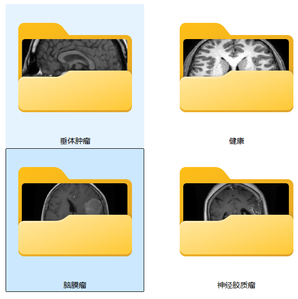
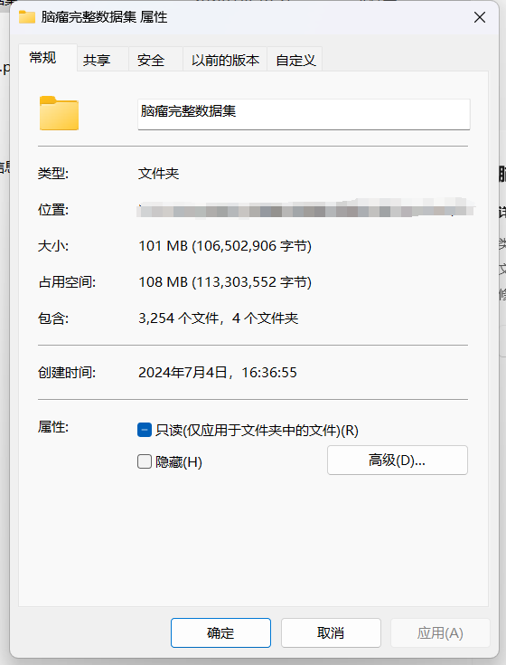
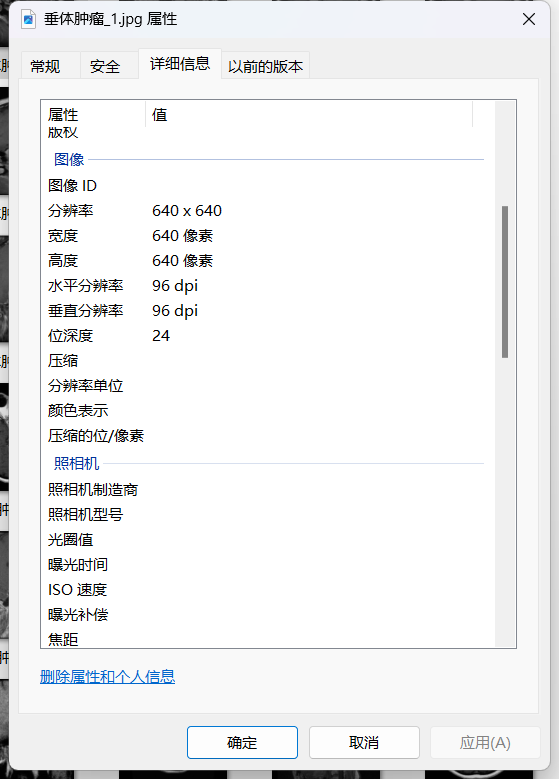

# Brain Tumor - Image Classification Dataset

Dataset Information Introduction: The number of images in the folder "Health" is: 500.
The number of images in the folder "Pituitary Tumor" is: 899.
The number of images in the folder "Glioblastoma" is: 926.
The number of images in the folder "Meningioma" is: 929.
The total number of images in all subfolders is: 3254.

For inquiries, just add your questions. There is no need for friend verification. You can directly send messages to me. I will be able to see them.
When searching for me, you can send a complete question at once. I will respond to you. Sometimes I am busy, so please describe your question and purpose clearly when asking.
I will also reply to you when I have free time, without any formalities. This makes the process more efficient.
Your phone number is the same as above. If I forget to reply or you are impatient, you can text or call.

## Images

Here is a pay link on Stripe ( https://buy.stripe.com/3cs8yP7sY87d0vu9AB ). Please contact me lonlonago@foxmail.com after funding $89, and I will send you a complete data files , thank you!

